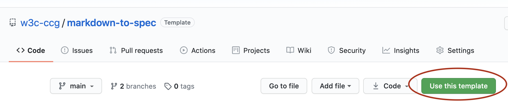
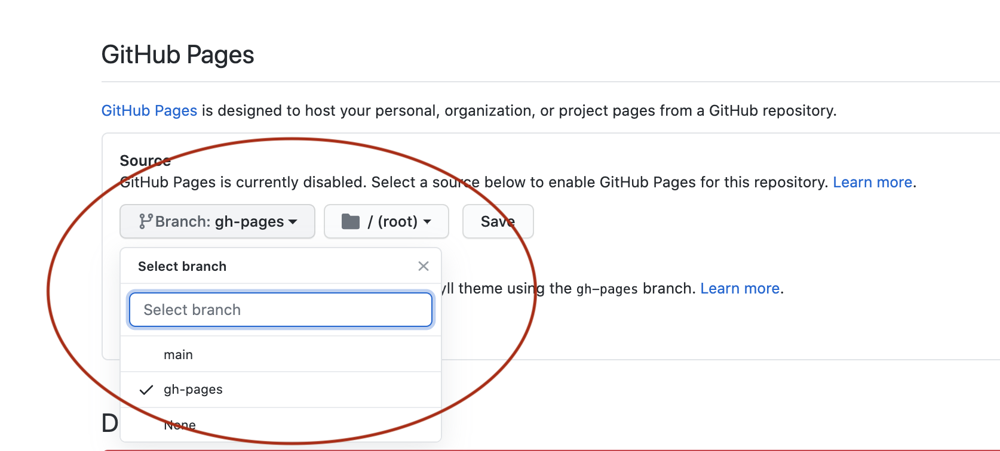

# markdown-to-spec
Markdown to spec template.

Use this if you want to write your spec in markdown (note .bs file extension) and use a github action to automatically convert to html, via bikeshed.

## Get started

1. Select "Use this template" and choose your repository

2. Go to Settings > Github Pages, and select `gh-pages` branch.

